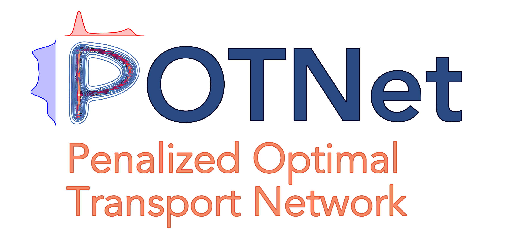

<div align="left">
  <a href="https://arxiv.org/abs/2402.10456">
    
  </a>
</div>


# Efficient Generative Modeling via Penalized Optimal Transport Network


<a href='https://arxiv.org/abs/2402.10456'>
    
</a> 

**POTNet** is a deep generative model for generating mixed-type tabular data (continuous/discrete/categorical) based on the marginally-penalized Wasserstein loss. 

This repository contains an implementation of the POTNet model as described in the paper:

[Efficient Generative Modeling via Penalized Optimal Transport Network<br>](https://arxiv.org/abs/2402.10456)<br>

## Installation <br />

**Python version**: 3.9.13

**Intall dependences**:
```bash
pip install -r requirements.txt
```

## Usage

To run the following package from command line, execute the following lines:

```bash
conda create -n env_name python=3.9 -n
conda activate env_name

pip install -r requirements.txt
pip install .

python3 demo.py
```

* **Input**: When using POTNet, continuous and discrete features should be represented as `float`. Categorical columns can be represented as either `str`, `int`, or `float`. 

* **Categorical features**: You will need to specify which columns correspond to categorical features via the `categorical_cols` argument using either column names (e.g. `['SEX', 'EDUCATION']`) or column indices (`[1, 2]`).

* **Numeric output**: 
    * If all numeric features are discrete, then specify `numeric_output_data_type = "integer"`.
    * If numeric features consist of both discrete and continuous types, then you need to specify each numeric feature type using a `dict`:
    ```python
        {'integer': [col1, col2], 
        'continuous': [col3, col4]}
    ```
    * By default, all numeric features are assumed to be continuous. You can also manually specify this via `numeric_output_data_type = "continuous"`

* **Conditional POTNet**: You can condition on a selection of numeric features by setting `conditional = True` in model initialization, and subsequently passing the features you wish to condition on via `conditioning_data` to POTNet during the fitting stage. For a concrete example, please see `./example/demo_lfi.ipynb` under section *Conditional POTNet*.

* **Missing values**: The data should not contain any missing values. 

## Example

We provide two examples for using POTNet, both deposited in the `./examples` folder:

1. **Likelihood-free inference** (`./examples/demo_lfi.ipynb`): We generate 3,000 samples consisting of all continous features from the model
    * $\theta_i \sim \mathrm{Unif}[-3, 3]$ for $i = 1, \dots, 5$
    * $\mu = (\theta_1, \theta_2)$
    * $\sigma_1 = \theta_3^2$
    * $\sigma_2 = \theta_4^2$
    * $\rho = \tanh(\theta_5)$ 
    * $\Sigma = ((\sigma_1^2, ~\rho \sigma_1 \sigma_2 ), (\rho \sigma_1 \sigma_2, ~\sigma_2^2))$
    * $X_j \sim \mathcal{N}(\mu, \Sigma)$ for $j = 1, \dots, 4$

2. **[Default of credit card clients](https://archive.ics.uci.edu/dataset/350/default+of+credit+card+clients)** (`./examples/demo_credit.ipynb`): For an example illustrating usage of POTNet for mixed-data types, We subsampled 1,000 samples from the credit default dataset, deposited in `./data/credit_card.csv`.


Below, we provide a simple template for using POTNet:

```python
from potnet import *

# load data
data = ...

# specify categorical columns
cat_cols = [col1, col2, col3]

# initialize POTNet
potnet_model= POTNet(embedding_dim=data.shape[1],
                      categorical_cols=cat_cols,
                      numeric_output_data_type = 'continuous', # continuous data
                      epochs=500,
                      batch_size=256,
                      save_checkpoint=True, # save checkpoint periodically
                      checkpoint_epoch = 50 # save checkpoint every 50 epochs
                      )

# fit POTNet
potnet_model.fit(data)

# generate 1000 synthetic samples
gen_data = potnet_model.generate(1000)

# save model
potnet_model.save('potnet_model.pt')
```

# Reference

If you use POTNet in your research or project, please cite the following paper:

```
@article{lu2024generative,
  title={Efficient Generative Modeling via Penalized Optimal Transport Network},
  author={Lu, Wenhui Sophia and Zhong, Chenyang and Wong, Wing Hung},
  journal={arXiv preprint arXiv:2402.10456},
  year={2025}
}
```
